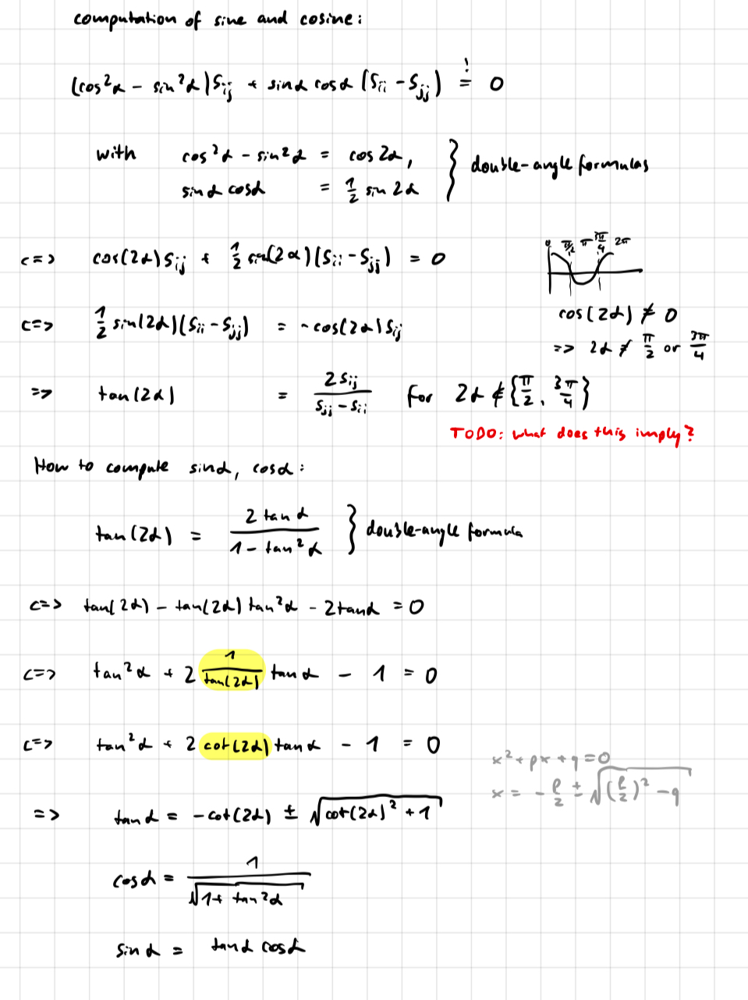

## Jacobi eigenvalue algorithm

A C implementation of the Jacobi eigenvalue algorithm, that is meant to be easily understandable.
 The code also includes tests that can be used to examine the accuracy of the algorithm.

There are faster and probably more accurate implementations of the algorithm, this one runs in O(n^2) per iteration.
 A C++ implementation for example can be found here https://github.com/jewettaij/jacobi_pd.

### Derivation of the sine and cosine computations used

